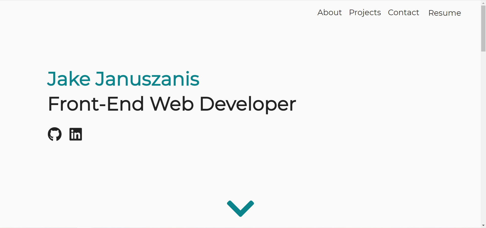

# Portfolio v3 Gatsby Edition



---

### Table of Contents

- [Description](#description)
- [How to Use](#how-to-use)

---

## Description

This my latest portfolio build that I created to showcase some of my recent projects. My last portfolio was alright and did its job but alright wasn’t good enough for me. I wanted a portfolio that would stand out. So I hopped on Figma and decided to completely redesign the layout and came up with this. I don’t consider myself to be a web designer by any means but I really like how this came out in the end. It’s simple, easy to navigate, and fully responsive on all screen sizes. I will continue to keep updating and making small changes for a better user experience. 

## Technology/Tools Used

- Gatsby
- React
- JavaScript
- SCSS
- Netlify
- Figma

## What I learned 

- For the first time ever I used Figma to design the site before actually writing any code. Having a general design concept before diving in made the building process way easier. Not nearly as much backtracking as some of my other projects.

- General web design principles. Concepts that I’ve overlooked in the past such as color selection for improved contrast and readability or even something as small as letter spacing or characters per line, are now on my radar and will be implemented into any future projects.

---

 ## How to use

 ### Prerequisites

 You'll need [Git](https://git-scm.com/) and [Node.js](https://nodejs.org/en/download/) (which comes with [NPM](https://www.npmjs.com/)) installed.
 
 Also, you will need [Gatsby](https://www.gatsbyjs.com/) CLI installed for Gatsby commands.
 ```
npm install -g gatsby-cli
 ```
 ### Installation
From the command line, clone the repository:
 ```
 # Clone this repository:
 $ git clone https://github.com/Jake-Januszanis/portfolio-v3

 # Move into the repository:
 $ cd portfolio-v3

 # Remove current origin repository:
 $ git remote rm origin 

 ```

 Now you’re ready to install the dependencies
 ```
# Install dependencies:
$ npm install
 ```

 Once the dependencies are installed you can run the development server
 ```
 # You can use either of these commands to start the server:
 $ npm start
    or 
 $ gatsby develop
 ```

 Once server has started, open browser and type in the URL localhost:8000 and the site will load.

---
 - [Back To The Top](#portfolio-v3-gatsby-edition)

 ## License 

 MIT License 

 Copyright 2021 Jake Januszanis

Permission is hereby granted, free of charge, to any person obtaining a copy of this software and associated documentation files (the "Software"), to deal in the Software without restriction, including without limitation the rights to use, copy, modify, merge, publish, distribute, sublicense, and/or sell copies of the Software, and to permit persons to whom the Software is furnished to do so, subject to the following conditions:

The above copyright notice and this permission notice shall be included in all copies or substantial portions of the Software.

THE SOFTWARE IS PROVIDED "AS IS", WITHOUT WARRANTY OF ANY KIND, EXPRESS OR IMPLIED, INCLUDING BUT NOT LIMITED TO THE WARRANTIES OF MERCHANTABILITY, FITNESS FOR A PARTICULAR PURPOSE AND NONINFRINGEMENT. IN NO EVENT SHALL THE AUTHORS OR COPYRIGHT HOLDERS BE LIABLE FOR ANY CLAIM, DAMAGES OR OTHER LIABILITY, WHETHER IN AN ACTION OF CONTRACT, TORT OR OTHERWISE, ARISING FROM, OUT OF OR IN CONNECTION WITH THE SOFTWARE OR THE USE OR OTHER DEALINGS IN THE SOFTWARE.

[Back To The Top](#portfolio-v3-gatsby-edition)

---

## Author Info 

- Website - [Jake Januszanis](http://jakejanuszanis.com)
- Linkedin - [@jakejanuszanis](https://www.linkedin.com/in/jake-januszanis/)

[Back To The Top](#portfolio-v3-gatsby-edition)